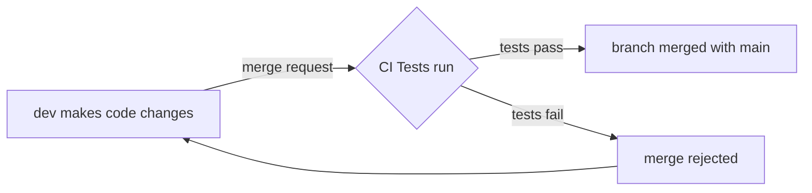

# Understanding Modern Software Development

## Overview
Modern programming can be a confusing mess if proper organizational patterns are not followed throughout the development and production processes. Luckily, senior programmers have been working on solutions for a long time. 

The first solution is the concept of DevOps culture. DevOps is the integration of development (building an application) and operations (running and maintaining the application) branches of a tech team. This strategy makes communication a top priority and minimizes the "blame game" that occurs when applications break.

The second solution is the use of automation to streamline software development. Automation is a super broad topic, but it can usually be condensed into the idea of CI/CD (continuous integration/continuous delivery). CI/CD speeds up and simplifies the dev process by encouraging fast bug-fixes and new feature implementations. CI/CD is somewhat confusing because it covers much more than the two implied abbreviations.

## Explaining CI/CD
The primary categories of CI/CD include:

- continuous testing
- continuous integration
- continuous delivery
- continuous deployment

### Continuous Testing
WIP

### Continuous Integration
Devs used to create separate branches to build new functions for an app. This could get messy when lots of devs have separate branches with lots of changes that would lead to confusing merge conflicts. To solve this problem continuous integration pushes devs to merge as often as possible. The basic logic:

### Continuous Delivery
Continuous delivery is sort of like deployment, but to an intermediate environment (staging or testing) instead of a production environment (the public Internet) It encompasses 3 main elements:

- automated environment configuration
- deployment to staging/testing
- larger scope testing (acceptance and end-to-end)

In a way, continuous delivery is an insurance policy that double checks that the new code is adequate to be released into the wild (production).

### Continuous Deployment
If new software has passed the gauntlet of tests thrown at it, then continuous deployment automates the process of getting it up and running on a production server. The public can now access the service and monitoring tools begin tracking data.

### The Cycle Continues
Either the introduction of new features or unveiling of new bugs will restart the whole pipeline. Devs will submit new/revised code and go through the process again.