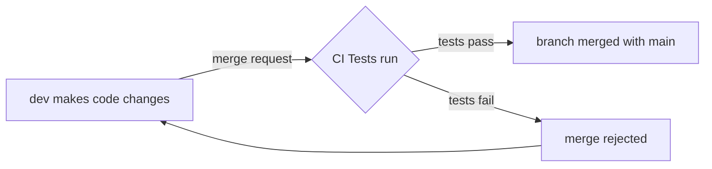

# Understanding Modern Software Development

## Overview
Modern programming can be a confusing mess if proper organizational patterns are not followed throughout the development and production processes. Luckily, senior programmers have been working on solutions for a long time. 

The first solution is the concept of DevOps culture. DevOps is the integration of development (building an application) and operations (running and maintaining the application) branches of a tech team. This strategy makes communication a top priority and minimizes the "blame game" that occurs when applications break.

The second solution is the use of automation to streamline software development. Automation is a super broad topic, but it can usually be condensed into the idea of CI/CD (continuous integration/continuous delivery). CI/CD is somewhat confusing because it covers much more than 2 ideas. Furthur explanations will be shown below.

## Explaining CI/CD
The primary categories of CI/CD include:

- continuous testing
- continuous integration
- continuous delivery
- continuous deployment

### Continuous Testing

### Continuous Integration
Devs used to create separate branches to build new functions for an app. This could get messy when lots of devs have separate branches with lots of changes that would lead to confusing merge conflicts. To solve this problem continuous integration pushes devs to merge as often as possible. The basic logic:
